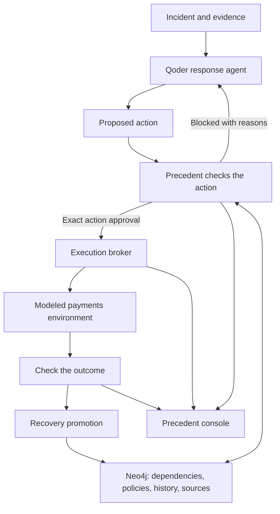

# Precedent

**Precedent checks an AI agent’s next action against what the system depends on and what happened before.**

Precedent helps an AI responder avoid fixing one problem by creating another. It brings together current dependencies, company policies, past incidents, and evidence sources before an action can run.

For example, an attacker copies a payments credential at the fictional Nexus Financial. Revoking it immediately would also break payments because the payment workers still use it. Precedent blocks that proposal and shows the dependencies and past cases behind the decision.

The intended recovery is to restrict the compromised credential, move the workers to a replacement, check that payments still work, and then revoke the old credential. Each action needs its own approval. A forged runbook cannot approve shutting down the ledger just by saying a security leader signed it.

The project currently runs a local demonstration with a modeled payments environment. The complete live recovery, independent traffic tests, and learning across fresh agent sessions still need to meet the acceptance checks in the plan.

> Check the context. Explain the decision. Verify the outcome.

[Build audit](docs/build-audit.md) · [Demo guide](docs/demo-guide.md) · [Design decisions](docs/design-principles.md)

## How it works

| Step        | What Precedent does                                                                                                         |
| ----------- | --------------------------------------------------------------------------------------------------------------------------- |
| Investigate | Qoder reads the incident, system dependencies, policies, and past cases.                                                    |
| Check       | Precedent evaluates a proposed action and the evidence it cites.                                                            |
| Intervene   | It allows the action, blocks it, suggests a revision, or asks for missing information.                                      |
| Execute     | A separate broker checks the approval before changing the demo environment.                                                 |
| Verify      | Probes report modeled payment, attacker, and ledger outcomes.                                                               |
| Remember    | A promotion path can save a successful recovery as a new case. Full validation and later reuse remain open acceptance work. |

## Architecture



The agent proposes actions. The broker controls execution. The console shows decisions and receipts; it does not create approvals.

Approvals are tied to the action, arguments, caller, run, state version, and expiry. The broker records an execution intent before a mutation. An uncertain result is marked unknown instead of being reported as successful.

## What we checked

- **Blocked revocation:** the H41 historical proposal receives `REVISE` while payment workers still use the old credential.
- **Evidence rejection:** the evaluator rejects untrusted evidence before allowing the requested action.
- **Copied credentials:** the range tests show that isolating the originating laptop does not stop off-device use of a copied credential.
- **Recovery guards:** tests cover migration, traffic switching, revocation, and duplicate mutation handling in the modeled range.
- **Console behavior:** the interface separates live agent events, historical replay, and counterfactual results. It exposes decision paths, execution receipts, probe times, and a selected-decision export.
- **Frontend checks:** tests cover stale response protection, request cancellation, and invalid response data. Type checking and the production build are separate checks.

These are bounded checks, not proof that every phase is finished. The [audit](docs/build-audit.md) records the remaining work, including real traffic generation, history-dependent recovery selection, immutable evidence, and the full live learning loop.

The historical cases H41, H72, H89, and H97 are fictional fixtures. They are created in `packages/graph/src/index.ts`. The range does not reproduce AWS IAM or operate a real payment network.

## How Qoder and Neo4j fit the project

| Technology             | Its role                                                                                                                                                             |
| ---------------------- | -------------------------------------------------------------------------------------------------------------------------------------------------------------------- |
| Qoder                  | Runs the response agent, discovers typed MCP tools, and receives permission decisions before execution. The SDK is pinned to `@qoder-ai/qoder-agent-sdk` **1.0.39**. |
| Neo4j                  | Stores dependencies, policies, source relationships, historical cases, evaluations, approvals, and execution records.                                                |
| Next.js and React Flow | Present the action stream, infrastructure graph, and evidence inspector.                                                                                             |
| TypeScript and Zod     | Define shared data contracts and check incoming data.                                                                                                                |

The runtime uses the local Qoder CLI session through `qodercliAuth()`. Development traces and a recorded complete demonstration still need to be packaged as submission evidence.

## Run locally

Requires Node.js 24+, npm 11+, a reachable Neo4j database, and an authenticated Qoder CLI session for live agent responses.

```sh
npm ci
cp .env.example .env
```

In `.env`, set the Neo4j connection details. Set `BROKER_RUNNER_TOKEN` and `RANGE_BROKER_TOKEN` to different random secrets. Keep this file out of version control. The example file lists the service addresses.

Authenticate your installed Qoder CLI, then start the workspace:

```sh
qodercli login
npm run dev
```

Open [localhost:3000](http://localhost:3000).

| Service | Local address    | What it runs                     |
| ------- | ---------------- | -------------------------------- |
| Console | `localhost:3000` | The incident interface           |
| Broker  | `127.0.0.1:3001` | Evaluation and execution checks  |
| Range   | `127.0.0.1:3002` | The controlled scenario model    |
| Runner  | `127.0.0.1:3003` | Qoder sessions and demo controls |

## Try the demo

1. **Replay H41 proposal.** Inspect a blocked credential revocation with a visible historical replay label. Select **Show me why** to read its evidence and paths.
2. **Compare response.** Inspect immediate revocation in the separate counterfactual model alongside the latest live-run probes. The comparison does not yet guarantee identical starting snapshots.
3. **Launch attack response.** Start a real Qoder session and follow its proposed actions. The current scenario already begins with a compromised credential; this button starts the response.

Under **Scenario tools & reset**, inject the forged runbook or reset the live topology while keeping learned memory. In the expanded decision trace, **Export selected decision** downloads that decision and the retained events for its run. This is not yet a complete durable run export.

If Qoder chooses a safe response immediately, show that honestly. Use the labeled H41 replay to demonstrate the blocked proposal instead of attributing it to the live agent.

## Verify the build

```sh
npm test
npm run typecheck
npm run build
npm run format
```

[Build audit and remaining acceptance work](docs/build-audit.md) · [Precedent design decisions](docs/design-principles.md)

## Keywords

AI agents · autonomous agents · agentic AI · AI safety · agent security · autonomous response · incident response · cyber defense · cybersecurity · decision support · institutional judgment · institutional memory · agent memory · verified memory · memory poisoning · prompt injection · evidence provenance · source authority · source verification · context graphs · knowledge graphs · graph retrieval · dependency analysis · blast radius · policy enforcement · action authorization · execution broker · audit trails · decision traces · tool permissions · MCP tools · credential compromise · credential rotation · payment continuity · staged recovery · outcome verification · counterfactual comparison · historical replay · idempotency · durable execution intents · fail-closed authorization · observability · Qoder · Qoder Agent SDK · Neo4j · Cypher · TypeScript · Zod · Node.js · Fastify · Next.js · React · React Flow · server-sent events · Vitest
